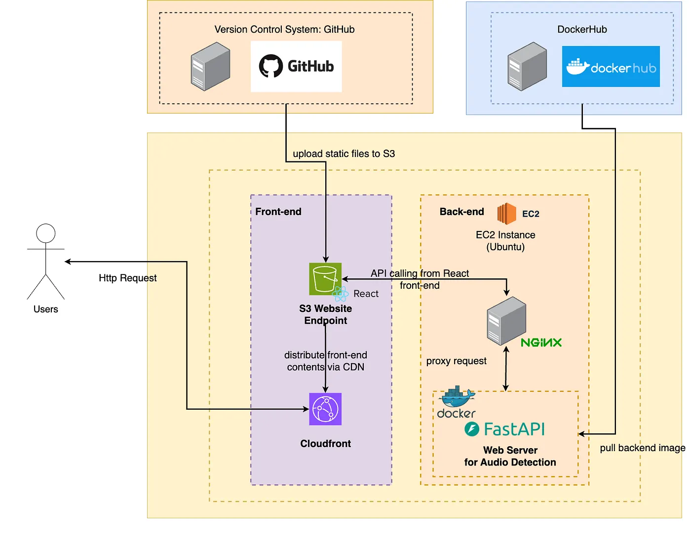

# 真偽語音偵測系統 (Audio Deepfake Detection System)
1. 專案概述
本專案是一個基於深度學習的真偽語音偵測系統，旨在應對日益猖獗的音訊深度偽造（Audio Deepfake）技術所帶來的挑戰。系統能夠接收一段語音檔案，並快速分析判斷其為真實人聲或是由 AI 合成的語音。

此專案解決了以下問題：

資訊安全：防止利用合成語音進行的詐騙、假冒身份等惡意行為。
媒體可信度：幫助辨識新聞、社交媒體中可能存在的誤導性音訊內容。
技術驗證：提供一個高效能的後端 API 服務，可輕易整合至既有的應用程式或工作流程中。

## 架構與功能設計

*   **架構設計**：基於 `Vite` + `React` 搭建現代化的前端開發環境，確保了快速的開發啟動速度和高效能的打包輸出。
*   **部署架構**： 前端包板後上傳至 AWS S3，以 Cloudfront 的方式做 CDN，購買域名後掛 TLS 憑證上去。

*   **核心功能開發**：
    *   **音訊輸入模組**：開發了兩種音訊輸入方式：
        1.  **即時錄音**：使用 `Web Audio API` 實現了瀏覽器端的即時錄音功能，並處理音訊數據的格式轉換與上傳。
        2.  **檔案上傳**：建立了拖放與點擊上傳元件 (`FileUpload.jsx`)，支援多種音訊格式，並提供上傳進度顯示。


## 技術 (Tech Stack)

| 類別 | 技術 / 工具 |
| :--- | :--- |
| **前端框架** | `React.js` |
| **打包與建置工具** | `Vite` |
| **樣式** | `Tailwind CSS`, `PostCSS` |
| **狀態管理** | `React Hooks (Context API)` |
| **語言** | `JavaScript (ES6+)`, `JSX` |
| **API 串接** | `Fetch API` / `Axios` |
| **程式碼品質** | `ESLint` |
| **國際化** | `i18next` |

## 安裝與使用方式

# 1. 複製專案
```
git clone https://github.com/pangolin0409/AudioDetector_frontend.git
```
# 2. 進入專案目錄
```
cd AudioDetector_frontend
```
# 3. 安裝依賴 (需要預先安裝 Node.js)
```
npm install
```
# 4. 設定環境變數
開發環境變數檔案是 .env，其中 VITE_API_BASE_URL 是指後端 Web Server domain 或是 IP，預設是 localhost:8000

# 5. 啟動伺服器
** 請注意！這是開發模式，如果要生產環境，需要 npm run build，將包板內容部署到 web server**
```
npm run dev
```

# 6. 包版（部署到生產環境步驟）

建立一個 .env.production，裡面填寫```VITE_API_BASE_URL=http://yourwebserver.com```

包版的 html, css, javascript 會放到一個 dist，裡面即靜態網頁，會抓.env.production來包版
```
npm run build
```

## 未來改進方向

*   **數據視覺化增強**：引入如 `D3.js` 或 `Chart.js` 等庫，提供更多樣化的數據視覺化圖表（例如：顯示音訊波形的聲譜圖），幫助使用者更深入地理解音訊內容。
*   **可解釋人工智慧（英語：Explainable AI，縮寫為XAI）**：除了檢測語音的真假以外，還能提供一份報告講述聲音特徵哪邊異常，例如：F1、F2 共振峰不連續、靜音片段過多等原因。